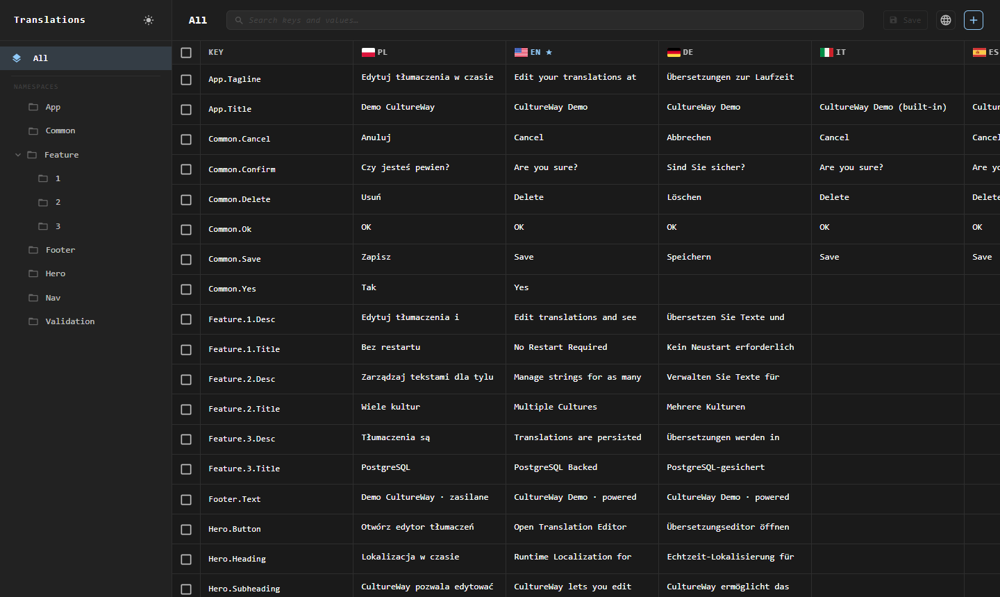
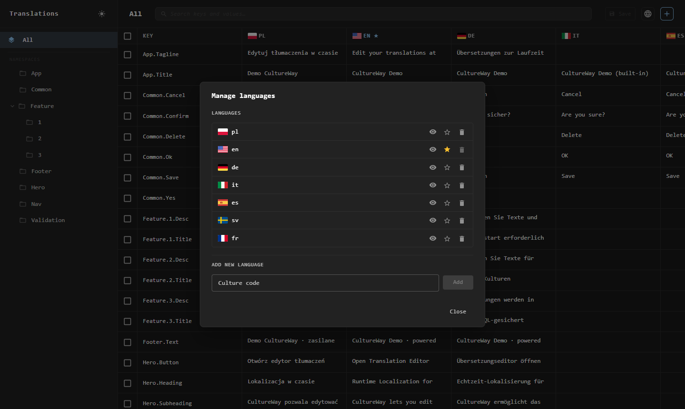
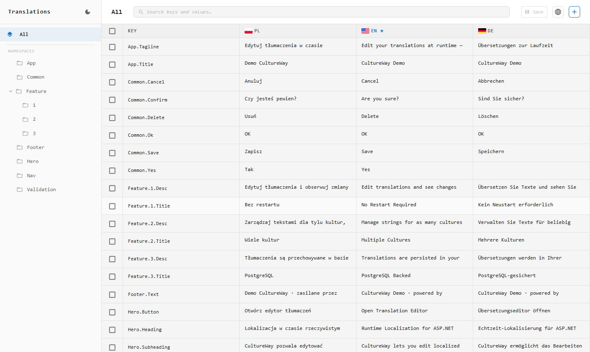

# CultureWay

[](https://github.com/kododo-dev/CultureWay/actions/workflows/ci.yml)
[](https://kododo.dev/cultureway/demo)

Runtime localization editor for ASP.NET Core. Translations are edited in a web UI built into your app and take effect immediately, without a rebuild or restart. Strings are resolved through the standard `IStringLocalizer`, so existing code keeps working.

A live demo is available at [kododo.dev/cultureway/demo](https://kododo.dev/cultureway/demo).

## UI







## Packages

| Package | NuGet | Description |
|---|---|---|
| `Kododo.CultureWay` | [](https://www.nuget.org/packages/Kododo.CultureWay) | Core DI registration, localizer, cache, in-memory store and `.resx` support |
| `Kododo.CultureWay.Core` | [](https://www.nuget.org/packages/Kododo.CultureWay.Core) | Abstractions (`IStore`, `IReadOnlySource`, `Translation`) for custom backends |
| `Kododo.CultureWay.UI` | [](https://www.nuget.org/packages/Kododo.CultureWay.UI) | Embedded web UI |
| `Kododo.CultureWay.PostgreSQL` | [](https://www.nuget.org/packages/Kododo.CultureWay.PostgreSQL) | PostgreSQL persistence store |

Targets `net8.0`, `net9.0` and `net10.0`.

## Quick start

```bash
dotnet add package Kododo.CultureWay.UI
dotnet add package Kododo.CultureWay.PostgreSQL  # optional, without it translations live in memory
```

```csharp
builder.Services.AddCultureWay(x =>
{
    x.Options.SupportedCultures = ["en", "pl", "de"];
    x.Options.DefaultCulture = "en";
    x.AddEditor();
    x.UsePostgreSQL(connectionString);
});

var app = builder.Build();

await app.InitializeCultureWayAsync();

app.UseRequestLocalization();
app.UseCultureWay("/translations"); // mounts the UI at /translations
```

Then use localization as usual:

```csharp
app.MapGet("/", (IStringLocalizer<Program> l) => l["App.Title"].Value);
```

`InitializeCultureWayAsync` creates the database schema, loads the translations into the cache and restores languages added at runtime.

## Languages

Languages can be added, deleted and set as default from the UI, and the store keeps them across restarts. Each browser can also hide languages it doesn't need. That only affects which columns the editor shows and is remembered in the browser's local storage.

Cultures added at runtime are also registered in ASP.NET Core's `RequestLocalizationOptions`, so the request localization middleware picks them up without a restart.

## `.resx` files

Existing resource files can be shown in the editor as a read-only baseline:

```csharp
builder.Services.AddLocalization(o => o.ResourcesPath = "Resources");

builder.Services.AddCultureWay(x =>
{
    x.UseResources<SharedResources>();
});
```

`UseResources<T>()` uses the same naming convention as `IStringLocalizer<T>`. Keys are prefixed with the type name (`SharedResources.Title`). Pass `prefix: ""` to use the raw keys or any other string to choose your own.

A key that comes from `.resx` can't be deleted. You can override its value, and later reset it to the value from the resource file.

## Security

The editor is not protected by default. Anyone who can reach the route can change or delete translations, so restrict it before exposing the app:

```csharp
app.UseCultureWay("/translations").RequireAuthorization("Admin");
```

## Custom store

Implement `IStore` from `Kododo.CultureWay.Core` and register it before `AddCultureWay`. A minimal store needs `InitializeAsync`, `GetAllAsync`, `SetAsync` and `DeleteAsync`.

The members that deal with languages (`GetSupportedCulturesAsync`, `AddSupportedCultureAsync`, `RemoveSupportedCultureAsync`, `GetDefaultCultureAsync`, `SetDefaultCultureAsync`) have default implementations that do nothing. Override them if you want languages changed in the UI to survive a restart.

## Running the demo

```bash
cd src/CultureWay.UI/SPA && npm ci && npm run build
cd ../../..
dotnet run --project src/CultureWay.Demo.Web --framework net10.0
```

Without a `DemoDB` connection string the demo uses the in-memory store.

## Building from source

```bash
cd src/CultureWay.UI/SPA && npm ci && npm run build
cd ../../..
dotnet test src/CultureWay.Tests
dotnet test src/CultureWay.PostgreSQL.Tests  # needs Docker (Testcontainers)
```

## License

[MIT](LICENSE)
